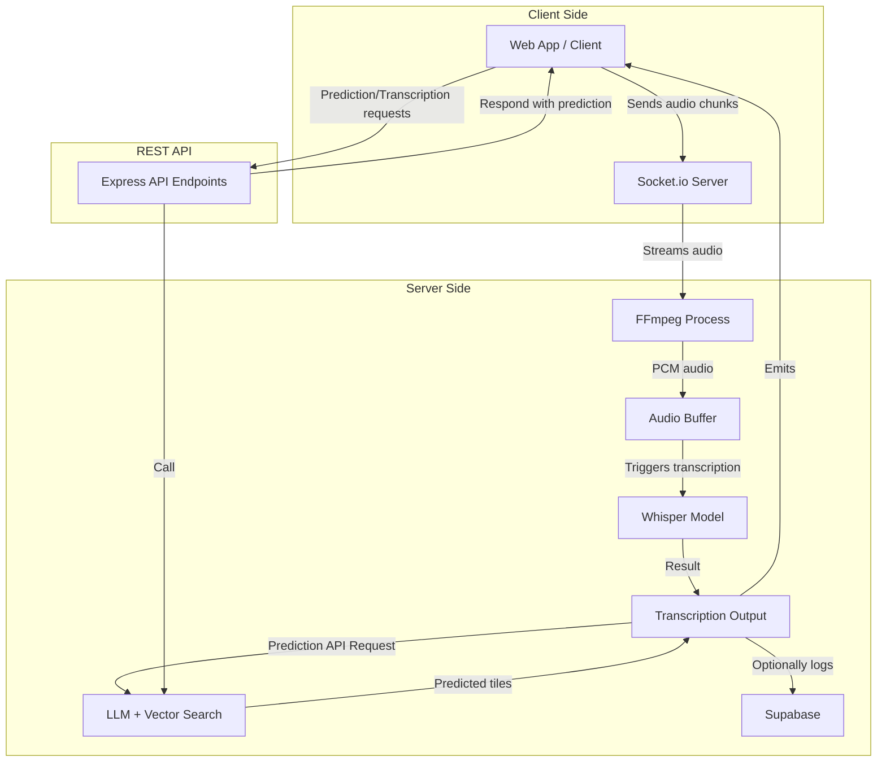

# Audio Transcription Server Documentation

This documentation explains the architecture, endpoints, data flow, and core logic of the `server.mjs` file, which implements a Node.js server for real-time audio transcription and intelligent tile/word prediction using both local Whisper and LLM models.

---

## Overview

The Audio Transcription Server enables real-time speech-to-text and context-aware word/tile suggestions for clients (such as web applications). It leverages:

- **Express** for HTTP and API endpoints
- **Socket.io** for real-time audio streaming
- **FFmpeg** for audio format conversion
- **Local Whisper model** for speech transcription
- **Local LLM (DistilGPT2)** and **vector search (MiniLM)** for word prediction
- **Supabase** (optional) for event logging

---

## System Architecture

The server handles both HTTP and WebSocket traffic, processes audio streams, and exposes API endpoints for prediction and transcription.



---

## Core Features

- **Real-time speech-to-text via Whisper**
- **Next tile/word prediction using context & pressed tiles**
- **Vector search for semantic matching**
- **LLM prompt-based filtering**
- **Supabase logging**
- **Process management and temp file cleanup**
- **Graceful shutdown when no clients are connected**

---

## Environment Variables

| Variable                     | Description                                 | Required? | Example                             |
|------------------------------|---------------------------------------------|-----------|-------------------------------------|
| `SUPABASE_URL`               | Supabase project REST API URL               | Optional  | `https://xyz.supabase.co`           |
| `SUPABASE_KEY`               | Supabase API Key                            | Optional  | `service-role-key`                  |
| `SUPABASE_LOG_TABLE`         | Supabase table for logging events           | Optional  | `transcript_highlights`             |

---

# API Endpoints

Below are all available API endpoints, their usage, input/output details, and example requests.

---

## Next Tile Prediction (Local LLM + Vector)

### `/api/nextTilePred` (POST)

Predicts the next set of tiles (words) based on transcript and/or pressed tiles using a local LLM and vector search.

#### Expected Input

- `transcript` (optional): Full or partial transcript text (string)
- `pressedTiles` (optional): Array of recently pressed tile strings

#### Output

- `predictedTiles`: Array of up to 10 suggested next tiles
- `status`: `success` or `error`
- `pressedTiles`: Array of tiles considered
- `context`: Text context used for prediction

#### Example Request

```bash
curl -X POST http://localhost:5000/api/nextTilePred \
  -H "Content-Type: application/json" \
  -d '{
    "transcript": "I would like to eat pizza",
    "pressedTiles": ["eat", "pizza"]
  }'
```

#### Example Response

```json
{
  "predictedTiles": ["drink", "water", "bread", "yes", "no", "please", "thankyou", "more", "help", "stop"],
  "status": "success",
  "context": "I would like to eat pizza",
  "pressedTiles": ["eat", "pizza"]
}
```

---

### API Block: Next Tile Prediction (POST)

```api
{
    "title": "Next Tile Prediction",
    "description": "Predict the next set of tiles/words based on transcript and/or pressed tiles using local LLM and vector search.",
    "method": "POST",
    "baseUrl": "http://localhost:5000",
    "endpoint": "/api/nextTilePred",
    "headers": [
        {
            "key": "Content-Type",
            "value": "application/json",
            "required": true
        }
    ],
    "queryParams": [],
    "pathParams": [],
    "bodyType": "json",
    "requestBody": "{\n  \"transcript\": \"I would like to eat pizza\",\n  \"pressedTiles\": [\"eat\", \"pizza\"]\n}",
    "responses": {
        "200": {
            "description": "Success",
            "body": "{\n  \"predictedTiles\": [\"drink\", \"water\", \"bread\", \"yes\", \"no\", \"please\", \"thankyou\", \"more\", \"help\", \"stop\"],\n  \"status\": \"success\",\n  \"context\": \"I would like to eat pizza\",\n  \"pressedTiles\": [\"eat\", \"pizza\"]\n}"
        },
        "400": {
            "description": "Validation error",
            "body": "{\n  \"error\": \"Either transcript or pressedTiles (or both) must be provided\",\n  \"status\": \"error\"\n}"
        },
        "500": {
            "description": "Internal error",
            "body": "{\n  \"error\": \"Internal server error\",\n  \"status\": \"error\"\n}"
        }
    }
}
```

---

## Next Tile Prediction (Local LLM, Customizable TopN)

### `/api/nextTilePredLocal` (POST)

Similar to `/api/nextTilePred`, but allows specifying the number of predictions (`topN`).

#### Expected Input

- `transcript` (optional): Full or partial transcript text (string)
- `pressedTiles` (optional): Array of recently pressed tile strings
- `topN` (optional): Number of top tiles to return (default: 10)

#### Output

- `predictedTiles`: Array of up to `topN` suggested next tiles
- `status`: `success` or `error`
- `pressedTiles`: Array of tiles considered
- `context`: Text context used for prediction

#### Example Request

```bash
curl -X POST http://localhost:5000/api/nextTilePredLocal \
  -H "Content-Type: application/json" \
  -d '{
    "transcript": "I am thirsty",
    "pressedTiles": ["drink"],
    "topN": 5
  }'
```

#### Example Response

```json
{
  "predictedTiles": ["water", "milk", "juice", "yes", "no"],
  "status": "success",
  "context": "I am thirsty",
  "pressedTiles": ["drink"]
}
```

---

### API Block: Next Tile Prediction Local (POST)

```api
{
    "title": "Next Tile Prediction Local",
    "description": "Predict the next set of tiles/words based on transcript and/or pressed tiles using local LLM and vector search, allowing custom topN.",
    "method": "POST",
    "baseUrl": "http://localhost:5000",
    "endpoint": "/api/nextTilePredLocal",
    "headers": [
        {
            "key": "Content-Type",
            "value": "application/json",
            "required": true
        }
    ],
    "queryParams": [],
    "pathParams": [],
    "bodyType": "json",
    "requestBody": "{\n  \"transcript\": \"I am thirsty\",\n  \"pressedTiles\": [\"drink\"],\n  \"topN\": 5\n}",
    "responses": {
        "200": {
            "description": "Success",
            "body": "{\n  \"predictedTiles\": [\"water\", \"milk\", \"juice\", \"yes\", \"no\"],\n  \"status\": \"success\",\n  \"context\": \"I am thirsty\",\n  \"pressedTiles\": [\"drink\"]\n}"
        },
        "400": {
            "description": "Validation error",
            "body": "{\n  \"error\": \"Either transcript or pressedTiles (or both) must be provided\",\n  \"status\": \"error\"\n}"
        },
        "500": {
            "description": "Internal error",
            "body": "{\n  \"error\": \"Internal server error\",\n  \"status\": \"error\"\n}"
        }
    }
}
```

---

# WebSocket (Real-time) Audio Transcription

Clients can connect to the server via Socket.io and stream audio in real time. The server transcribes audio and emits results back.

## WebSocket Events

### Client → Server

- **audio-chunk**: Send a chunk of raw WebM audio data.

### Server → Client

- **transcript**: Emits the latest transcribed text.

## Example Client Usage (JavaScript)

```js
import io from "socket.io-client";

const socket = io("http://localhost:5000");

// ... obtain an audio chunk (arraybuffer) ...
socket.emit("audio-chunk", audioBuffer);

// Listen for transcription results
socket.on("transcript", (text) => {
  console.log("Transcribed:", text);
});
```

---

# Core Functions

Here are the main utility and processing functions provided by the server, along with their descriptions:

| Function                      | Purpose                                                      |
|-------------------------------|--------------------------------------------------------------|
| `findRelevantWords`           | Matches context text with potential relevant words            |
| `calculateRMSEnergy`          | Computes RMS (energy) of audio samples                       |
| `wavToFloat32Array`           | Converts WAV buffer to normalized Float32Array               |
| `validateTranscription`       | Checks transcription for validity and hallucinations         |
| `createWavFile`               | Constructs a WAV file from PCM data                          |
| `calculateSimilarity`         | Word-overlap similarity of two texts                         |
| `cleanTranscription`          | Removes non-speech markers from transcription                |

---

## Example: Finding Relevant Words

```js
const context = "I would like to drink water";
const words = ["yes", "no", "drink", "water", "bread", "hello"];
const relevant = findRelevantWords(context, words);
// Output: ["drink", "water", "yes", "no", ...]
```

---

# Logging Events to Supabase

Whenever predictions or highlights occur, the server can log to a Supabase table if configured, storing:

- transcript_text
- highlighted_words
- pressed_tiles
- confidence_by_word
- event_time
- source

This is handled internally for analytics and is not a public endpoint.

---

# Graceful Shutdown & Self-Cleanup

- The server tracks active connections.
- If all clients disconnect, it sets a timer to shut down itself and the associated frontend (if running).
- It performs cleanup of all temporary audio files and kills associated processes.

---

# Preloading Models

On startup, the server loads all required ML models in parallel:

- Whisper (for speech recognition)
- DistilGPT2 (for LLM text generation)
- all-MiniLM-L6-v2 (for embeddings)

This ensures that first requests are fast and responsive.

---

```card
{
    "title": "Production Use Advice",
    "content": "Use powerful hardware for best experience. For production, ensure Supabase credentials are secured and temp files are regularly cleaned."
}
```

---

# Error Handling

- **Invalid inputs**: The endpoints return HTTP 400 with error messages.
- **Internal errors**: HTTP 500 with details.
- **Audio issues**: The server discards or retries problematic buffers.

---

# Security & Best Practices

- Never expose Supabase `service_role_key` in client code.
- Regularly clean up temporary files.
- Always run the server behind a firewall in production.

---

# Conclusion

This server is a robust solution for real-time audio transcription and context-aware prediction using only local, open-source models and minimal dependencies, with optional event logging. Its REST API and real-time WebSocket interface make it suitable for interactive, assistive, and multimodal applications.

If you have further questions or need more integration examples, please refer to the code or contact the maintainer.

---