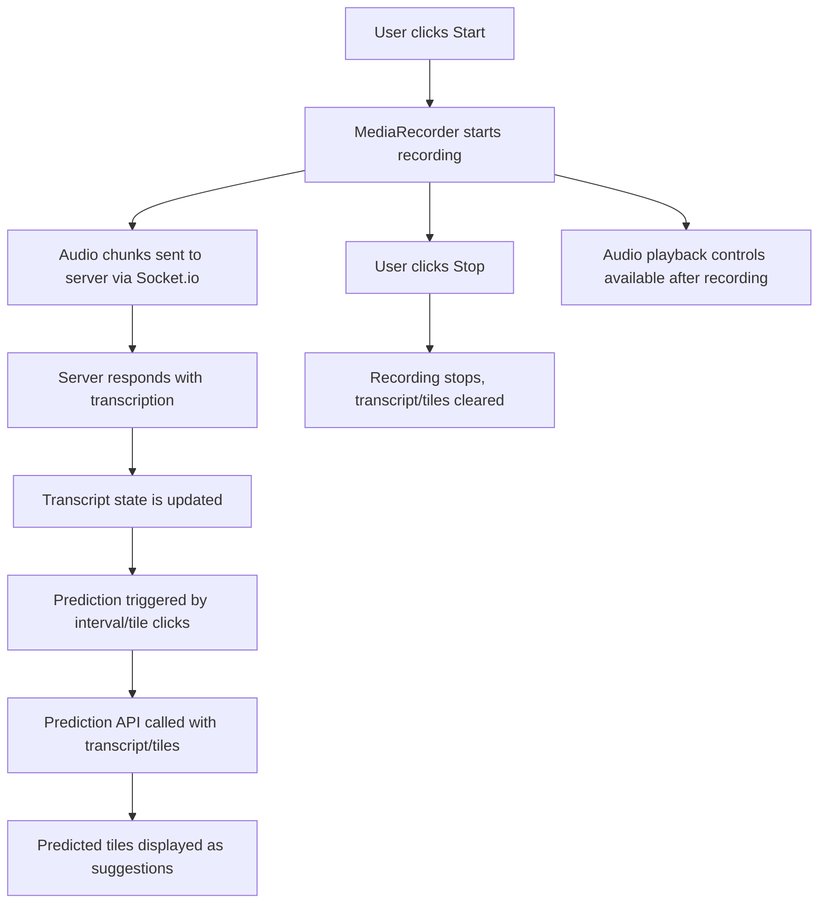

# AudioTranscription.tsx 📻

The `AudioTranscription.tsx` file implements a **React component** for real-time audio transcription and tile prediction, using the browser's microphone, the [MediaRecorder API](https://developer.mozilla.org/en-US/docs/Web/API/MediaRecorder), and a backend via [Socket.io](https://socket.io/).

This component is ideal for applications that require speech-to-text capabilities with intelligent suggestions (tiles) based on both spoken words and tile interactions—such as communication boards or accessible UIs for AAC (Augmentative and Alternative Communication).

---

## Component Purpose

- **Records audio** from the user via the browser.
- Sends audio chunks to a local transcription server via WebSockets.
- Receives live transcription results and displays them.
- Predicts and displays "next tiles" (suggested actions or words) based on the transcript and tile interactions.
- Provides UI controls for starting/stopping recording, audio playback, and fetching suggestions.

---

## Key Features & Data Flow

- **Live audio recording** and real-time transcription.
- **Tile prediction** via a backend API endpoint.
- **Periodic and debounced prediction triggers** (every 15 seconds and on user tile clicks).
- **User interface** for controlling recording, viewing transcriptions, and exploring predictions.
- **Playback controls** for recorded audio.

---

## Dependencies

- `socket.io-client` for WebSocket communication.
- Several state/context providers (e.g., `useTranscript`, `usePredictedTiles`, `useUtteredTiles`, `useRecordingControl`)—assumed to be from the app's custom state management system.

---

## Component Structure

### Main State & Refs

| Name                | Type                       | Purpose                                         |
|---------------------|---------------------------|-------------------------------------------------|
| record              | boolean                    | If recording is active                          |
| transcript          | string                     | Current transcript text                         |
| audioURL            | string \| null             | Recorded audio file URL                         |
| audioProgress       | number                     | Audio playback progress (0–100%)                |
| isPlaying           | boolean                    | If audio is currently playing                   |
| predictedTiles      | string[]                   | Tile suggestions from backend                   |
| utteredTiles        | Array<{ text: string } >   | Tiles "pressed" by the user                     |
| isActive            | boolean                    | If recording/session is enabled                 |
| isPredicting        | boolean                    | If a prediction request is in progress          |
| ...                 | ...                        | Various refs for timers, intervals, handlers    |

---

## Core Workflow



---

## UI Controls and Layout

- **Start/Stop** button toggles audio recording and prediction.
- **Transcript area** shows the latest transcription.
- **Tile prediction** section with:
  - Search (🔍) button to manually fetch suggestions.
  - List of suggested tiles (or "No suggestions yet").
- **Audio playback** controls (if a recording exists):
  - Play/Pause button.
  - Progress bar with current/total time.

---

# API Endpoints

The component interacts with two backend endpoints:

---

## 1. Socket.io: Real-Time Transcription

**Purpose:** Sends audio chunks to the backend, receives live transcription.

- **Client emits:** `audio-chunk`
- **Server emits:** `transcript` (with transcribed text)

> **No REST endpoint, handled via Socket.io events.**

**Example flow:**
- Client emits: `audio-chunk` (binary)
- Server responds: `transcript` (string)

---

## 2. POST `/api/nextTilePred` — Predict Next Tiles

### Predict Next Tiles (POST)

#### Description

Predicts the most likely next tiles based on the current transcript and/or tiles the user has just pressed. Used for intelligent next-word or next-action suggestions.

#### Request

- **Method:** `POST`
- **URL:** `http://localhost:5000/api/nextTilePred`
- **Headers:** `Content-Type: application/json`
- **Body:**
  - `transcript`: (string, optional) Current transcript from audio
  - `pressedTiles`: (array of string, optional) Recent pressed tile texts

#### Response

- **200 OK** (success):
  ```json
  {
    "status": "success",
    "predictedTiles": ["Hello", "How are you", "Goodbye"]
  }
  ```
- **Error JSON**:
  ```json
  {
    "status": "error",
    "error": "Error message"
  }
  ```

---

### API Block: Predict Next Tiles

#### Predict Next Tiles - POST

```api
{
  "title": "Predict Next Tiles",
  "description": "Suggests next possible tiles based on the transcript and/or pressed tiles.",
  "method": "POST",
  "baseUrl": "http://localhost:5000",
  "endpoint": "/api/nextTilePred",
  "headers": [
    {
      "key": "Content-Type",
      "value": "application/json",
      "required": true
    }
  ],
  "queryParams": [],
  "pathParams": [],
  "bodyType": "json",
  "requestBody": "{\n  \"transcript\": \"I want to go\",\n  \"pressedTiles\": [\"I\", \"want\", \"to\", \"go\"]\n}",
  "responses": {
    "200": {
      "description": "Prediction results",
      "body": "{\n  \"status\": \"success\",\n  \"predictedTiles\": [\"to the park\", \"home\", \"outside\"]\n}"
    },
    "400": {
      "description": "Bad Request",
      "body": "{\n  \"status\": \"error\",\n  \"error\": \"Missing required input\"\n}"
    }
  }
}
```

---

### Usage Example

**Request:**
```bash
curl -X POST http://localhost:5000/api/nextTilePred \
  -H "Content-Type: application/json" \
  -d '{"transcript": "Can you help", "pressedTiles": ["Can", "you", "help"]}'
```

**Response:**
```json
{
  "status": "success",
  "predictedTiles": ["me", "with this", "please"]
}
```

---

# Main Functions & Their Roles

Here are the most relevant internal methods in the component:

| Function                       | Purpose                                                                                     | Usage Context               |
|--------------------------------|--------------------------------------------------------------------------------------------|-----------------------------|
| `startRecording()`             | Starts MediaRecorder, sets up listeners, and begins sending audio to server                | On start/auto-start         |
| `stopRecording()`              | Stops MediaRecorder, removes listeners, clears transcript & predictions                    | On stop or inactive         |
| `predictNextTiles()`           | Calls `/api/nextTilePred` to get suggestions based on transcript/tiles                     | On interval, tile click     |
| `setupPeriodicPredictionInterval()` | Sets up 15s interval for automatic prediction calls                                 | On recording                |
| `togglePlayback()`             | Plays or pauses recorded audio                                                             | On play/pause button        |
| `handleTimeUpdate()`           | Updates progress bar as audio plays                                                        | On audio playback           |

---

### Special Logic: Prediction Triggers

- **Periodic:** Every 15 seconds during recording, if transcript or tiles have content, prediction is called.
- **Debounced by Tile Clicks:** When the user clicks tiles, a prediction is made after 1.5 seconds of inactivity, so rapid clicks don't spam the API.
- **Manual:** User can press the 🔍 button to force a prediction.

---

# Example UI Flow

1. **User clicks Start:** Microphone permission is requested. If granted, recording begins.
2. **Audio chunks stream to backend:** Transcription server emits transcript snippets, which display in real time.
3. **User presses tiles:** Prediction is (debounced) triggered and suggestions update.
4. **User clicks 🔍:** Manual prediction request is sent.
5. **Recording stops:** Transcript and suggestions reset; audio playback controls appear.

---

# Error Handling & User Experience

- All prediction API calls are **throttled** to prevent overload (min 500ms between requests).
- Failures in prediction API do **not clear existing suggestions**—previous results stay visible for smoother UX.
- Socket and recorder resources are **cleaned up** on component unmount.
- UI shows "No suggestions yet" if there are no prediction results.

---

# Card: Key Takeaways

```card
{
  "title": "Key Takeaways",
  "content": "AudioTranscription offers real-time voice transcription and intelligent tile suggestions, combining live audio, WebSockets, and REST APIs for a robust, accessible user experience."
}
```

---

# Summary

- **`AudioTranscription.tsx`** provides a comprehensive UI and logic for live audio transcription and predictive suggestions.
- Uses **Socket.io** for real-time transcription and a **REST API** for predictive tile suggestions.
- Designed for responsive, accessible, and interactive communication applications.

---

**For further integration, ensure your backend supports the Socket.io and `/api/nextTilePred` endpoints as documented above.**